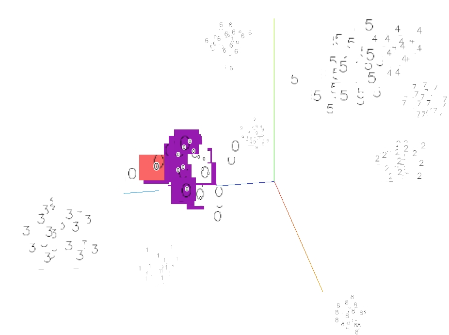
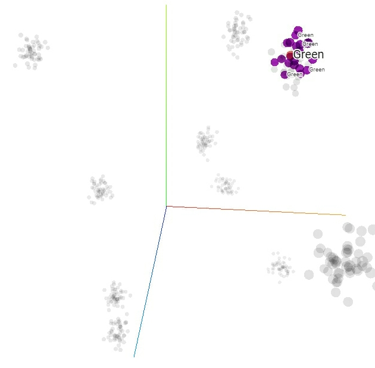
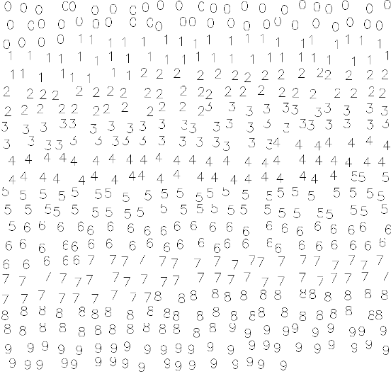

## Intro
Visualization of high dimensional data is very important in data science. Google has open-sourced a tool called `Embedding Projector` which makes it much easier. It is a build-in tool of Google's [TensorFlow](https://tensorflow.org) framework. And there is also a standalone version [here](https://github.com/tensorflow/embedding-projector-standalone)

The following content is about **HOW TO** use the **STANDALONE** tool.


## Steps

### Check out this project

Depends on `opencv-python`, install the module if you don't have one on your system.

```shell
git clone https://github.com/cnzeki/embedding-projector
cd embedding-projector
```

### Try it out

```shell
python projector.py
```

Open your browser to :  http://localhost:8000

#### With sprite:



#### With label



### How to visualize your own data

The `Embedding Projector`  takes a NxD tensor as input, N is the number of samples (or embeddings), D is the dimension of each sample. The tensor is stored in a file (raw float bytes for tsv). A sample is a point in the plot. We can attach some metas to a sample, a image (called `sprite`), or labels ( class id or names).

A example sprite image:



I wrote a function to make everything done, just call it with your data. Tensor is stored as binary bytes.

```
write_image_embeddings(root, title, feats, labels, imgs, sprite_size)
'''
:param root: root dir of `Embedding Project` tool
:param title: name of the tensor
:param feats: embedding tensor NxDim
:param labels: labels for each sample NxNumClasses
:param [optional] imgs: images in format NHWC
:param [optional] sprite_size: image sprite size
:param mode: 'w' -- write, 'w+' -- update or append, '+' -- append
'''
```

If you want to write tensor in tsv format, use this instead:

```python
write_tsv_embeddings(prefix, feats, labels=None):
```

Tsv files can be load in the web page on-line.

For more details, read the code please.

